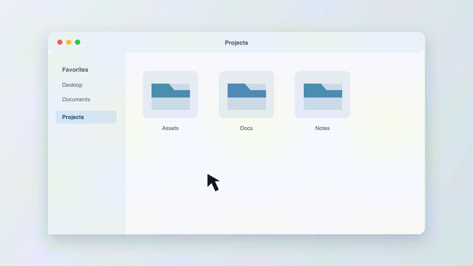

# New File Creator

New File Creator is a small macOS Finder Sync extension that adds file creation commands to Finder's context menu.



It adds a single native-looking **New File** item to Finder's context menu with a submenu of file types:

- `Untitled.txt`
- `Untitled.md`

If a file already exists, the app creates the next available name, such as `Untitled 1.txt`.

## How It Works

Finder Sync extensions are sandboxed, so the extension does not write files directly. The extension only reads Finder's current target folder and opens a private `newfilecreator://` URL. The containing app handles that URL and creates the file.

This keeps the Finder extension small and avoids unreliable direct writes from the extension process.

### Background agent (snappiness)

The containing app is a headless `LSUIElement` agent (no Dock icon, no menu bar item). On first launch it registers itself as a login item via `SMAppService`, so it stays resident in the background and relaunches at login. Because the agent is already warm, the `newfilecreator://` round-trip skips the cold app launch and file creation feels instant.

### Native menu

The menu is presented as one **New File** parent item with a file-type submenu, mirroring Finder's own patterns (e.g. "New Folder with Selection"). Leading icons are applied only on macOS versions where native context menus show them (macOS 26+), using template SF Symbols so they tint correctly in dark mode.

### Enabling the extension

macOS requires a one-time user toggle to enable any Finder Sync extension — there is no supported API to flip it automatically. If the extension is not yet enabled, the agent shows a small onboarding window that deep-links to the correct Settings pane for your macOS version and watches for the toggle, restarting Finder automatically once it is on. After that, the extension stays enabled across restarts.

## Requirements

- macOS 14.0 or newer
- Xcode 15 or newer

## Build

```bash
make build
```

The built app is written to:

```text
build/NewFileCreator.app
```

The build script uses ad-hoc signing so the app can run locally without an Apple Developer account.

Regenerate the app icon assets from the source SVG:

```bash
make icons
```

Regenerate the README demo media:

```bash
make demo
```

## Install Locally

First build the app:

```bash
make build
```

Then register it with macOS:

```bash
make install-local
```

This command:

1. Verifies `build/NewFileCreator.app`
2. Copies the app to `/Applications` (a stable path is required so the login item registers correctly)
3. Registers the app's `newfilecreator://` URL scheme
4. Registers and best-effort enables the Finder Sync extension with `pluginkit`
5. Launches the agent, which registers the login item and shows the onboarding window if the extension is not yet enabled
6. Restarts Finder

If macOS still does not show the menu item, enable the extension manually:

```text
System Settings -> Privacy & Security -> Extensions -> Finder Extensions
```

Enable `New File Creator`, then restart Finder:

```bash
killall Finder
```

## Usage

### From the Finder context menu

1. Open a Finder window.
2. Right-click inside the folder, or right-click a folder or item.
3. Choose `New File`, then a file type from the submenu.

The new file is created in the targeted Finder folder and selected in Finder.

> Finder controls where third-party context-menu items appear, so the `New File`
> item is grouped with other extension items (toward the bottom of the menu), not
> above Finder's built-in `New Folder`. This placement cannot be changed via the
> Finder Sync API.

### From the global shortcuts (work on the Desktop)

Press a shortcut anywhere to create a file in the folder Finder is currently
showing — including the Desktop, which the Finder context menu cannot reach. The
file is created and selected immediately by the resident background agent.

Defaults:

- **⌃⌥⌘N** — new text file
- **⌃⌥⌘M** — new Markdown file

The first time you use a shortcut, macOS asks for permission for New File Creator to
control Finder (Automation). Approve it once; the shortcuts work silently after that.

### Settings

The app is headless (no Dock or menu bar icon). To change the shortcuts, **double-click
`New File Creator` in `/Applications`** — the running agent opens a Settings window
where you can rebind each shortcut, disable either one, or reset to defaults. Changes
apply immediately.

## Development Notes

The project intentionally keeps the extension thin:

- `FinderSync.swift` builds the Finder menu, resolves the target folder, and opens the app URL.
- `AppDelegate.swift` parses the app URL, creates a unique file name, writes the file, and reveals it in Finder.

The default bundle identifier is:

```text
io.github.tjansn.NewFileCreator
```

This matches the `tjansn` GitHub namespace.

## Release Checklist

Before publishing a release, decide how you want users to install it:

- For source-only distribution, `make build` and `make install-local` are enough.
- For binary distribution, sign with a Developer ID certificate and notarize the app.
- Keep generated files out of git. The included `.gitignore` excludes `build/`, `DerivedData/`, Xcode user state, and packaged app artifacts.

Build a Developer ID signed release archive:

```bash
SIGN_IDENTITY='Developer ID Application: Your Name (TEAMID)' \
DEVELOPMENT_TEAM='TEAMID' \
./scripts/package-release.sh
```

Build, submit for notarization, staple the ticket, and create a final zip:

```bash
SIGN_IDENTITY='Developer ID Application: Your Name (TEAMID)' \
DEVELOPMENT_TEAM='TEAMID' \
NOTARY_PROFILE='new-file-creator' \
./scripts/package-release.sh
```

Create the notary profile once with:

```bash
xcrun notarytool store-credentials new-file-creator
```

## Troubleshooting

If the menu item does not appear:

```bash
pluginkit -m -p com.apple.FinderSync -A -D -v | grep NewFileCreator
killall Finder
```

Also verify that the app was launched or registered after building. `make install-local` does this automatically.

## Project Structure

```text
NewFileCreator/
  NewFileCreator.xcodeproj
  NewFileCreator/                      # containing app (headless background agent)
    AppDelegate.swift                  # URL handling, login item, hotkeys, file creation
    GlobalHotKey.swift                 # Carbon global shortcut + Finder location lookup
    HotKeyConfiguration.swift          # shortcut persistence and defaults
    PreferencesWindowController.swift  # Settings UI + shortcut recorder
    OnboardingWindowController.swift    # extension-enable onboarding
    Info.plist
    MainMenu.xib
    Assets.xcassets/
  NewFileExtension/                    # sandboxed Finder Sync extension
    FinderSync.swift                   # builds the context menu, resolves target folder
    Info.plist
    NewFileExtension.entitlements
scripts/
  build.sh
  install-local.sh
  package-release.sh
```

## License

MIT. See `LICENSE`.
